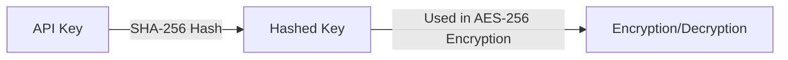

## Encryption Options
<CardGroup cols={2}>
  <Card title="Query String Encryption" icon="square-1">
    Query String Encryption
  </Card>
  <Card title="Secure Data Transmission Options" icon="square-2">
    Secure Data Transmission Options
  </Card>
  <Card title="Encryption/Decryption Methods" icon="square-3">
    Encryption/Decryption Methods
  </Card>
</CardGroup>

## 1. Query String Encryption

Sensitive data sent via URL query strings is encrypted using the AES-256 encryption method.

<Steps>
  <Step title="Prepare Data in JSON Format">
    <CodeGroup>
    ```javascript data.json
    {
        "email": "email@email.com",
        "userid": "userid",
        "cf1": "value 1",
        "cf2": "value 2",
        "cf3": "value 3",
        "blacklistCountries": false,
        "approvePeriod": false,
        "rejectPeriod": false,
        "ageLimit": false,
        "rejectDuplicateUser": true,
        "token": "token_id",
        "allowedCountries": "USA, KOR"
    }
    ```
    </CodeGroup>
  </Step>
  <Step title="Perform AES-256 Encryption Using the Provided API Key">
    
  </Step>
  <Step title="Add Encrypted Data to the URL as the 'encrypted' Query Parameter">
    <CodeGroup>
    ```text example.txt
    https://form.argosidentity.com/?pid={project_Id}&encrypted={encrypted_json_text}
    ```
    </CodeGroup>
  </Step>
</Steps>

<Warning>  
**Caution**: The following query parameters are not encrypted: `pid`, `lang`, `sid`, `action`.  
The `pid`, `lang` query strings and the `sid`, `action` query strings used on the "Additional Process (Injection)" page do not support encryption.
</Warning>


##  2. Query String Encryption and Decryption Methods

### 2-1. Key Generation Process


<Steps>
  <Step title="Generate Hashed Key">
    <CodeGroup>
    ```javascript Node.js(crpyto module)
    var crypto = require('crypto');
    var hashedKey = crypto.createHash('sha256').update(APIKEY).digest();

    ```
    ```javascript Node.js(crypto-js library)
    import CryptoJS from 'crypto-js';
    const hashedKey = CryptoJS.SHA256(APIKEY);

    ```
    </CodeGroup>
  </Step>
  <Step title="Encryption Example">
   Below are examples of encrypting data using AES-256
      <CodeGroup>
    ```javascript Node.js(crpyto module)
      var crypto = require('crypto');

      /**
      * @param {string} data - Stringified JSON data
      * @param {string} apiKey - Project API key
      * @returns {string} Encrypted data
      */
      function encrypt(data, apiKey) {
        var hashedKey = crypto.createHash('sha256').update(apiKey).digest();
        var cipher = crypto.createCipheriv('aes-256-ecb', hashedKey, null);
        return cipher.update(data, 'utf8', 'base64') + cipher.final('base64');
      }
    ```
    ```javascript Node.js(crypto-js library)
   import CryptoJS from 'crypto-js';

    const encrypt = (data, apiKey) => {
      const hashedKey = CryptoJS.SHA256(apiKey);
      const encrypted = CryptoJS.AES.encrypt(data, hashedKey, {
        mode: CryptoJS.mode.ECB,
      });
      return encrypted.ciphertext.toString(CryptoJS.enc.Base64);
    };

    ```
    ```java java(crypto-js library)
      import javax.crypto.Cipher;
      import javax.crypto.spec.SecretKeySpec;
      import java.nio.charset.StandardCharsets;
      import java.security.MessageDigest;
      import java.util.Base64;

      public class Encryption {
          public static String encrypt(String data, String apiKey) throws Exception {
              // Hash the API key using SHA-256
              MessageDigest digest = MessageDigest.getInstance("SHA-256");
              byte[] hashedKey = digest.digest(apiKey.getBytes(StandardCharsets.UTF_8));
              
              // Ensure the key is 32 bytes long for AES-256 compatibility
              byte[] aesCompatibleKey = new byte[32];
              System.arraycopy(hashedKey, 0, aesCompatibleKey, 0, 32);
              
              // Create the AES key for encryption
              SecretKeySpec secretKey = new SecretKeySpec(hashedKey, "AES");
              
              // Initialize the Cipher in AES/ECB/PKCS5Padding mode
              Cipher cipher = Cipher.getInstance("AES/ECB/PKCS5Padding");
              cipher.init(Cipher.ENCRYPT_MODE, secretKey);
              
              // Encrypt the data
              byte[] encryptedBytes = cipher.doFinal(data.getBytes(StandardCharsets.UTF_8));
              
              // Return the encrypted result encoded in Base64
              return Base64.getEncoder().encodeToString(encryptedBytes);
          }
      }
    ```
    </CodeGroup>
  </Step>
  <Step title="Decryption Example">
  Below are examples of decrypting data encrypted with AES-256
    <CodeGroup>
    ```javascript Node.js(crpyto module)
        var crypto = require('crypto');

      /**
      * @param {string} encryptedData
      * @param {string} apiKey
      * @returns {string} Decrypted data
      */
      function decrypt(encryptedData, apiKey) {
        var hashedKey = crypto.createHash('sha256').update(apiKey).digest();
        var decipher = crypto.createDecipheriv('aes-256-ecb', hashedKey, null);
        return decipher.update(encryptedData, 'base64', 'utf8') + decipher.final('utf8');
      }

    ```
    ```javascript Node.js(crypto-js library)
   import CryptoJS from 'crypto-js';

    const decrypt = (encryptedData, apiKey) => {
      const hashedKey = CryptoJS.SHA256(apiKey);
      const decrypted = CryptoJS.AES.decrypt(encryptedData, hashedKey, {
        mode: CryptoJS.mode.ECB
      });
      return decrypted.toString(CryptoJS.enc.Utf8);
    };
    ```
    </CodeGroup>
  </Step>
</Steps>


## 3. Secure Data Transmission Options

API methods (POST/SUBMISSION, GET/SUBMISSION, PUT/SUBMISSION, WEBHOOK) encrypt transmitted data using <Tooltip tip="AES-256-CBC is a symmetric-key block encryption algorithm that uses a 256-bit key to encrypt data in 128-bit blocks. The CBC (Cipher Block Chaining) mode enhances security by XORing each block with the previous block's ciphertext before encryption. It is widely used by financial institutions and government organizations.">AES-256-CBC</Tooltip> and <Tooltip tip="A system that enables secure communication through the creation, management, and distribution of digital certificates. It uses public-key encryption to verify identities and protect data over the internet.">PKI</Tooltip>.
### 3-1. Key Features
- Uses AES-256-CBC algorithm for data encryption
- Ensures data integrity and authentication through PKI
- Enhances data protection during transmission


### 3-2. Data Encryption and Decryption Process
Data transmitted via API is encrypted using AES-256-CBC, and key management is based on SHA-256 hashing.

1. Encryption Algorithm Details
- Encryption method: AES-256-CBC
- Key generation: SHA-256 hash-based
- Output encoding: Base64

2. Encryption Parameters
- Key size: 32 bytes (256 bits)
- IV size: 16 bytes (128 bits)
- Character encoding: UTF-8

### 3-3. Payload Encryption Process
The following JavaScript and Java/Kotlin example demonstrates the client-side data encryption process.
    <CodeGroup>
    ```javascript Node.js(crypto-js library)
    var crypto = require('crypto');import CryptoJS from 'crypto-js';

    function generateKeyAndIV(apiKey) {
        const hashedKey = CryptoJS.SHA256(apiKey);
        const key = CryptoJS.lib.WordArray.create(hashedKey.words.slice(0, 8), 32);
        const iv = CryptoJS.lib.WordArray.create(hashedKey.words.slice(8, 12), 16);
        return { key, iv };
    }

    function encrypt(data, apiKey) {
        const { key, iv } = generateKeyAndIV(apiKey);
        const encrypted = CryptoJS.AES.encrypt(JSON.stringify(data), key, { iv: iv, mode: CryptoJS.mode.CBC });
        return encrypted.ciphertext.toString(CryptoJS.enc.Base64);
    }

    ```
    </CodeGroup>

### 3-4. Payload Decryption Process
The following JavaScript and Java/Kotlin example demonstrates how to decrypt the received encrypted data.
    <CodeGroup>
    ```kotlin Decrpyt Module
  import javax.crypto.Cipher
  import javax.crypto.spec.IvParameterSpec
  import javax.crypto.spec.SecretKeySpec
  import java.security.MessageDigest
  import java.util.Base64
  import java.nio.charset.StandardCharsets

  class DecryptionException(message: String, cause: Throwable? = null) : Exception(message, cause)

  class Decryptor {
      companion object {
          private const val ALGORITHM = "AES/CBC/PKCS5Padding"
          private const val KEY_ALGORITHM = "AES"
          private const val HASH_ALGORITHM = "SHA-256"
      }

      fun decrypt(encryptedData: String, apiKey: String): String {
          try {
              val digest = MessageDigest.getInstance(HASH_ALGORITHM)
              val hashedBytes = digest.digest(apiKey.toByteArray(StandardCharsets.UTF_8))
              
              val cipherBytes = Base64.getDecoder().decode(encryptedData.trim())
              // Extracts the key from the hashed value
              val key = SecretKeySpec(hashedBytes.copyOf(32), KEY_ALGORITHM)
              // Extracts the IV from the hashed value
              val iv = IvParameterSpec(hashedBytes.copyOfRange(16, 32)) 

              val cipher = Cipher.getInstance(ALGORITHM)
              cipher.init(Cipher.DECRYPT_MODE, key, iv)

              val decryptedBytes = cipher.doFinal(cipherBytes)
              return String(decryptedBytes, StandardCharsets.UTF_8)

          } catch (e: Exception) {
              throw DecryptionException("Decryption failed: ${e.message}", e)
          }
      }
  }
  ```
  ```javascript Node.js(crpyto module)
    import CryptoJS from 'crypto-js';

    function generateKeyAndIV(apiKey) {
        const hashedKey = CryptoJS.SHA256(apiKey); 
        const key = CryptoJS.lib.WordArray.create(hashedKey.words.slice(0, 8), 32); 
        const iv = CryptoJS.lib.WordArray.create(hashedKey.words.slice(8, 12), 16);
        return { key, iv };
    }

    function decrypt(encryptedData, apiKey) {
        const { key, iv } = generateKeyAndIV(apiKey);
        const decrypted = CryptoJS.AES.decrypt(
            CryptoJS.lib.CipherParams.create({ ciphertext: CryptoJS.enc.Base64.parse(encryptedData) }), key, { iv: iv, mode: CryptoJS.mode.CBC });
        return JSON.parse(decrypted.toString(CryptoJS.enc.Utf8));
    }
    ```
  </CodeGroup>

### 3-5. Examples
  <CodeGroup>
    ```kotlin Decrpyt Module
    fun main() {
    val apiKey = "your-api-key"
    val encryptedPayload = "encrypted-payload"

    val decryptor = WebhookDecryptor()
    try {
        val decryptedJson = decryptor.decrypt(encryptedPayload, apiKey)
        println("$decryptedJson")
    } catch (e: DecryptionException) {
        println("${e.message}")
        e.printStackTrace()
    }
  }
    ```
    ```javascript Node.js(crpyto module)
    import CryptoJS from 'crypto-js';

    function main() {
        const apiKey = "your-api-key"
        const encryptedPayload = "encrypted-base64-string"
        const decryptedJson = decrypt(encryptedPayload, apiKey);
        console.log("Decrypted webhook payload: ", decryptedJson)
    }
    ```
  </CodeGroup>