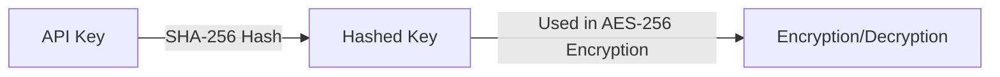

We provide robust encryption solutions to securely protect customer data, minimizing the risks of unauthorized access and data breaches. This guide explains how to implement these solutions easily in various environments while adhering to the latest security standards.

## Encryption Options
<CardGroup cols={2}>
  <Card title="Query String Encryption" icon="square-1">
    Query String Encryption
  </Card>
  <Card title="Secure Data Transfer Options" icon="square-2">
    Secure Data Transfer Options
  </Card>
  <Card title="Encryption/Decryption Methods" icon="square-3">
    Encryption/Decryption Methods
  </Card>
</CardGroup>

## 1. Query String Encryption

Sensitive data sent via URL query strings is encrypted using the AES-256 encryption method.

<Steps>
  <Step title="Prepare Data in JSON Format">
    <CodeGroup>
    ```javascript data.json
    {
        "email": "email@email.com",
        "userid": "userid",
        "cf1": "value 1",
        "cf2": "value 2",
        "cf3": "value 3",
        "blacklistCountries": false,
        "approvePeriod": false,
        "rejectPeriod": false,
        "ageLimit": false,
        "rejectDuplicateUser": true,
        "token": "token_id",
        "allowedCountries": "USA, KOR"
    }
    ```
    </CodeGroup>
  </Step>
  <Step title="Perform AES-256 Encryption Using the Provided API Key">
    
  </Step>
  <Step title="Add Encrypted Data to the URL as the 'encrypted' Query Parameter">
    <CodeGroup>
    ```text example.txt
    https://form.argosidentity.com/?pid={project_Id}&encrypted={encrypted_json_text}
    ```
    </CodeGroup>
  </Step>
</Steps>

<Warning>  
**Caution**: The following query parameters are not encrypted: `pid`, `lang`, `sid`, `action`.  
The `pid`, `lang` query strings and the `sid`, `action` query strings used on the "Additional Process (Injection)" page do not support encryption.
</Warning>

## 2. Secure Data Transfer Options

Data in API methods (POST/SUBMISSION, GET/SUBMISSION, PUT/SUBMISSION, WEBHOOK) is encrypted using <Tooltip tip="A symmetric key encryption algorithm that encrypts data in 128-bit blocks using a 256-bit key. It is highly secure and widely used by government and financial institutions.">AES-256</Tooltip> and <Tooltip tip="A system that generates, manages, and distributes digital certificates to enable secure communication. It uses public key encryption for identity verification and data security over the internet.">PKI</Tooltip>.

### 2-1. Key Features
- Data encryption using AES-256.
- Data integrity and authentication guaranteed via PKI.
- Enhanced data protection during transmission.


## 3. Encryption and Decryption Methods

### 3-1. Key Generation Process


<Steps>
  <Step title="Generate Hashed Key">
    <CodeGroup>
    ```javascript Node.js(crpyto module)
    var crypto = require('crypto');
    var hashedKey = crypto.createHash('sha256').update(APIKEY).digest();

    ```
    ```javascript Node.js(crypto-js library)
    import CryptoJS from 'crypto-js';
    const hashedKey = CryptoJS.SHA256(APIKEY);

    ```
    </CodeGroup>
  </Step>
  <Step title="Encryption Example">
   Below are examples of encrypting data using AES-256
      <CodeGroup>
    ```javascript Node.js(crpyto module)
      var crypto = require('crypto');

      /**
      * @param {string} data - Stringified JSON data
      * @param {string} apiKey - Project API key
      * @returns {string} Encrypted data
      */
      function encrypt(data, apiKey) {
        var hashedKey = crypto.createHash('sha256').update(apiKey).digest();
        var cipher = crypto.createCipheriv('aes-256-ecb', hashedKey, null);
        return cipher.update(data, 'utf8', 'base64') + cipher.final('base64');
      }
    ```
    ```javascript Node.js(crypto-js library)
   import CryptoJS from 'crypto-js';

    const encrypt = (data, apiKey) => {
      const hashedKey = CryptoJS.SHA256(apiKey);
      const encrypted = CryptoJS.AES.encrypt(data, hashedKey, {
        mode: CryptoJS.mode.ECB,
      });
      return encrypted.ciphertext.toString(CryptoJS.enc.Base64);
    };

    ```
    ```java java(crypto-js library)
      import javax.crypto.Cipher;
      import javax.crypto.spec.SecretKeySpec;
      import java.nio.charset.StandardCharsets;
      import java.security.MessageDigest;
      import java.util.Base64;

      public class Encryption {
          public static String encrypt(String data, String apiKey) throws Exception {
              
              MessageDigest digest = MessageDigest.getInstance("SHA-256");
              byte[] hashedKey = digest.digest(apiKey.getBytes(StandardCharsets.UTF_8));

             
              SecretKeySpec secretKey = new SecretKeySpec(hashedKey, "AES");

              
              Cipher cipher = Cipher.getInstance("AES/ECB/PKCS5Padding");
              cipher.init(Cipher.ENCRYPT_MODE, secretKey);

             
              byte[] encryptedBytes = cipher.doFinal(data.getBytes(StandardCharsets.UTF_8));

             
              return Base64.getEncoder().encodeToString(encryptedBytes);
          }
      }
    ```
    </CodeGroup>
  </Step>
  <Step title="Decryption Example">
  Below are examples of decrypting data encrypted with AES-256
    <CodeGroup>
    ```javascript Node.js(crpyto module)
        var crypto = require('crypto');

      /**
      * @param {string} encryptedData
      * @param {string} apiKey
      * @returns {string} Decrypted data
      */
      function decrypt(encryptedData, apiKey) {
        var hashedKey = crypto.createHash('sha256').update(apiKey).digest();
        var decipher = crypto.createDecipheriv('aes-256-ecb', hashedKey, null);
        return decipher.update(encryptedData, 'base64', 'utf8') + decipher.final('utf8');
      }

    ```
    ```javascript Node.js(crypto-js library)
   import CryptoJS from 'crypto-js';

    const decrypt = (encryptedData, apiKey) => {
      const hashedKey = CryptoJS.SHA256(apiKey);
      const decrypted = CryptoJS.AES.decrypt(encryptedData, hashedKey, {
        mode: CryptoJS.mode.ECB
      });
      return decrypted.toString(CryptoJS.enc.Utf8);
    };
    ```
    </CodeGroup>
  </Step>
</Steps>

