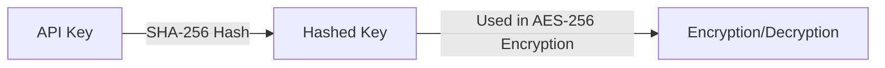

## Encryption and Decryption Tool

<Tip>
  For development purposes, provide the Encryption and Decryption Tool.\
  You may download it via this [link](https://argos-doc.s3.ap-northeast-2.amazonaws.com/EncryptionTool.zip) and verify the results are accurate.

  cf\> In macOS, it requires allowing launching this app in the "Privacy & Security" settings menu.
</Tip>


## Encryption Options

<CardGroup cols="2">
  <Card title="Query String Encryption" icon="square-1">
    Query String Encryption
  </Card>
  <Card title="Secure Data Transmission Options" icon="square-2">
    Secure Data Transmission Options
  </Card>
  <Card title="Encryption/Decryption Methods" icon="square-3">
    Encryption/Decryption Methods
  </Card>
</CardGroup>

## 1. Query String Encryption

Sensitive data sent via URL query strings is encrypted using the AES-256 encryption method.

<Steps>
  <Step title="Prepare Data in JSON Format">
    <Info>
      Refer to the link below for each parameter description

      [Key Query String Parameters](https://developers.argosidentity.com/getting-started/en/liveform-url/querystring-and-token-guide#2-1-key-query-string-parameters)
    </Info>
    <CodeGroup>

    ```json id_document.json
    {
        "email": "email@email.com",
        "userid": "userid",
        "cf1": "value 1",
        "cf2": "value 2",
        "cf3": "value 3",
        "blacklistCountries": false,
        "approvePeriod": false,
        "rejectPeriod": false,
        "ageLimit": false,
        "rejectDuplicateUser": true,
        "token": "token_id",
        "allowedCountries": "USA, KOR"
    }
    ```

    
    ```json knowledge_based.json
    {
        "email": "email@email.com",
        "userid": "userid",
        "cf1": "value 1",
        "cf2": "value 2",
        "cf3": "value 3",
        "knowledgeField": "birthDate,gender,nationality,name,SSN,name,address,phoneNumber",
        "knowledgePrefill" : "gender=male,nationality=USA,SSN=123-34-0001,address=Washington D.C.,name=Brown James,birthDate=1980-01-01,phoneNumber=+15555551234",
        "blacklistCountries": false,
        "ageLimit": false,
        "rejectDuplicateUser": true,
        "allowedCountries": "USA"
    }
    ```

    </CodeGroup>
  </Step>
  <Step title="Perform AES-256 Encryption Using the Provided API Key">
    
  </Step>
  <Step title="Add Encrypted Data to the URL as the 'encrypted' Query Parameter">
    <CodeGroup>

    ```text example.url
    https://form.argosidentity.com/?pid={project_Id}&encrypted={encrypted_json_text}
    ```

    </CodeGroup>
  </Step>
</Steps>

<Warning>
  **Caution**: The following query parameters are not encrypted: `pid`, `lang`, `sid`, `action`.\
  The `pid`, `lang` query strings and the `sid`, `action` query strings used on the "Additional Process (Injection)" page do not support encryption.
</Warning>

## 2. Query String Encryption and Decryption Methods

### 2-1. Key Generation Process



<Steps>
  <Step title="Generate Hashed Key">
    <CodeGroup>

    ```javascript Node.js(crpyto module)
    var crypto = require('crypto');
    var hashedKey = crypto.createHash('sha256').update(APIKEY).digest();
    
    ```

    
    ```javascript Node.js(crypto-js library)
    import CryptoJS from 'crypto-js';
    const hashedKey = CryptoJS.SHA256(APIKEY);
    
    ```

    </CodeGroup>
  </Step>
  <Step title="Encryption Example">
    Below are examples of encrypting data using AES-256

    <CodeGroup>

    ```javascript Node.js(crpyto module)
      var crypto = require('crypto');
    
      /**
      * @param {string} data - Stringified JSON data
      * @param {string} apiKey - Project API key
      * @returns {string} Encrypted data
      */
      function encrypt(data, apiKey) {
        var hashedKey = crypto.createHash('sha256').update(apiKey).digest();
        var cipher = crypto.createCipheriv('aes-256-ecb', hashedKey, null);
        return cipher.update(data, 'utf8', 'base64') + cipher.final('base64');
      }
    ```

    
    ```javascript Node.js(crypto-js library)
    import CryptoJS from 'crypto-js';
    
    const encrypt = (data, apiKey) => {
      const hashedKey = CryptoJS.SHA256(apiKey);
      const encrypted = CryptoJS.AES.encrypt(data, hashedKey, {
        mode: CryptoJS.mode.ECB,
      });
      return encrypted.ciphertext.toString(CryptoJS.enc.Base64);
    };
    
    ```

    
    ```java java(crypto-js library)
      import javax.crypto.Cipher;
      import javax.crypto.spec.SecretKeySpec;
      import java.nio.charset.StandardCharsets;
      import java.security.MessageDigest;
      import java.util.Base64;
    
      public class Encryption {
          public static String encrypt(String data, String apiKey) throws Exception {
              // Hash the API key using SHA-256
              MessageDigest digest = MessageDigest.getInstance("SHA-256");
              byte[] hashedKey = digest.digest(apiKey.getBytes(StandardCharsets.UTF_8));
              
              // Ensure the key is 32 bytes long for AES-256 compatibility
              byte[] aesCompatibleKey = new byte[32];
              System.arraycopy(hashedKey, 0, aesCompatibleKey, 0, 32);
              
              // Create the AES key for encryption
              SecretKeySpec secretKey = new SecretKeySpec(hashedKey, "AES");
              
              // Initialize the Cipher in AES/ECB/PKCS5Padding mode
              Cipher cipher = Cipher.getInstance("AES/ECB/PKCS5Padding");
              cipher.init(Cipher.ENCRYPT_MODE, secretKey);
              
              // Encrypt the data
              byte[] encryptedBytes = cipher.doFinal(data.getBytes(StandardCharsets.UTF_8));
              
              // Return the encrypted result encoded in Base64
              return Base64.getEncoder().encodeToString(encryptedBytes);
          }
      }
    ```

    </CodeGroup>
  </Step>
  <Step title="Decryption Example">
    Below are examples of decrypting data encrypted with AES-256

    <CodeGroup>

    ```javascript Node.js(crpyto module)
        var crypto = require('crypto');
    
      /**
      * @param {string} encryptedData
      * @param {string} apiKey
      * @returns {string} Decrypted data
      */
      function decrypt(encryptedData, apiKey) {
        var hashedKey = crypto.createHash('sha256').update(apiKey).digest();
        var decipher = crypto.createDecipheriv('aes-256-ecb', hashedKey, null);
        return decipher.update(encryptedData, 'base64', 'utf8') + decipher.final('utf8');
      }
    
    ```

    
    ```javascript Node.js(crypto-js library)
    import CryptoJS from 'crypto-js';
    
    const decrypt = (encryptedData, apiKey) => {
      const hashedKey = CryptoJS.SHA256(apiKey);
      const decrypted = CryptoJS.AES.decrypt(encryptedData, hashedKey, {
        mode: CryptoJS.mode.ECB
      });
      return decrypted.toString(CryptoJS.enc.Utf8);
    };
    ```

    </CodeGroup>
  </Step>
</Steps>

## 3. Secure Data Transfer Options

Encrypt data for secure transmission in API methods (GET, POST, PATCH) and WEBHOOKs. API methods use the `AES-256-ECB` encryption method, while WEBHOOKs use `AES-256-CBC` encryption. Ensure that secure data transfer is enabled before using it to protect sensitive information.


If this option is enabled, the request body must be encrypted. Inquire about a body parameter that is encrypted data. It is necessary to encrypt AES-256-ECB and refer to the Key Features and instructions on how to encrypt.

<CodeGroup>

```json body
body : encrypt({
		email : 'string',
		fullName : 'string',
		issuingCountry : 'string',
		birthDate: 'string'
		...
	})
```

</CodeGroup>

Responses include encrypted data and the “isEncrypted” flag.

<CodeGroup>

```json response.json
body : {
    "data": "encrypted-string",
    "isEncrypted": true
}
```

</CodeGroup>

### 3-1. Key Features

- GET, POST, PATCH requests are encrypted using `AES-256-ECB`
- WEBHOOK data is encrypted using `AES-256-CBC`
- Ensures data integrity and authentication through PKI
- Enhances data protection during transmission

### 3-2. API Request Data Encryption (AES-256-ECB)

<CodeGroup>

```javascript Node.js(crypto-js library)
import CryptoJS from 'crypto-js';
const CryptoJS = require('crypto-js');

function encryptECB(data, apiKey) {
    const hashedKey = CryptoJS.SHA256(apiKey);
    const key = CryptoJS.lib.WordArray.create(hashedKey.words.slice(0, 8), 32);
    const encrypted = CryptoJS.AES.encrypt(JSON.stringify(data), key, {
        mode: CryptoJS.mode.ECB
    });
    return encrypted.ciphertext.toString(CryptoJS.enc.Base64);
}
```


```java AES-256-ECB.java
import javax.crypto.Cipher;
import javax.crypto.spec.SecretKeySpec;
import java.nio.charset.StandardCharsets;
import java.security.MessageDigest;
import java.util.Base64;
import com.google.gson.Gson;
import com.google.gson.JsonObject;

public class Encryptor {
    public static String encryptECB(JsonObject data, String apiKey) throws Exception {
        Gson gson = new Gson();
        String jsonData = gson.toJson(data);
        
        MessageDigest digest = MessageDigest.getInstance("SHA-256");
        byte[] rawKeyBytes = digest.digest(apiKey.getBytes(StandardCharsets.UTF_8));
        byte[] hashedKey = new byte[32];
        System.arraycopy(rawKeyBytes, 0, hashedKey, 0, 32);
        SecretKeySpec key = new SecretKeySpec(hashedKey, "AES");
        Cipher cipher = Cipher.getInstance("AES/ECB/PKCS5Padding");
        cipher.init(Cipher.ENCRYPT_MODE, key);
        
        byte[] encryptedBytes = cipher.doFinal(jsonData.getBytes(StandardCharsets.UTF_8));
        return Base64.getEncoder().encodeToString(encryptedBytes);
    }
}
```

</CodeGroup>

### 3-3. API Data Decryption (AES-256-ECB)

<CodeGroup>

```javascript Node.js(crypto-js library)
const CryptoJS = require('crypto-js');

function decryptECB(encryptedData, apiKey) {
    const hashedKey = CryptoJS.SHA256(apiKey);
    const key = CryptoJS.lib.WordArray.create(hashedKey.words.slice(0, 8), 32);
    const cipherParams = CryptoJS.lib.CipherParams.create({
        ciphertext: CryptoJS.enc.Base64.parse(encryptedData)
    });
    const decrypted = CryptoJS.AES.decrypt(cipherParams, key, {
        mode: CryptoJS.mode.ECB
    });
    return JSON.parse(decrypted.toString(CryptoJS.enc.Utf8));
}
```


```java AES-256-ECB.java
import javax.crypto.Cipher;
import javax.crypto.spec.SecretKeySpec;
import java.nio.charset.StandardCharsets;
import java.security.MessageDigest;
import java.util.Base64;
import com.google.gson.Gson;
import com.google.gson.JsonObject;

public class Encryptor {
    public static JsonObject decryptECB(String encryptedData, String apiKey) throws Exception {
        Gson gson = new Gson();
        MessageDigest digest = MessageDigest.getInstance("SHA-256");
        byte[] hashedKey = digest.digest(apiKey.getBytes(StandardCharsets.UTF_8));
        byte[] aesCompatibleKey = new byte[32];
        System.arraycopy(hashedKey, 0, aesCompatibleKey, 0, 32);
        SecretKeySpec key = new SecretKeySpec(aesCompatibleKey, "AES");
        Cipher cipher = Cipher.getInstance("AES/ECB/PKCS5Padding");
        cipher.init(Cipher.DECRYPT_MODE, key);
        
        byte[] decryptedBytes = cipher.doFinal(Base64.getDecoder().decode(encryptedData));
        String jsonData = new String(decryptedBytes, StandardCharsets.UTF_8);
        return gson.fromJson(jsonData, JsonObject.class);
    }
}
```

</CodeGroup>

### 3-4. WEBHOOK Data Encryption (AES-256-CBC)

<CodeGroup>

```javascript Node.js (crypto-js library)
import CryptoJS from 'crypto-js';

function generateKeyAndIV(apiKey) {
    const hashedKey = CryptoJS.SHA256(apiKey);
    const key = CryptoJS.lib.WordArray.create(hashedKey.words.slice(0, 8), 32);
    const iv = CryptoJS.lib.WordArray.create(hashedKey.words.slice(8, 12), 16);
    return { key, iv };
}

function encryptCBC(data, apiKey) {
    const { key, iv } = generateKeyAndIV(apiKey);
    const encrypted = CryptoJS.AES.encrypt(JSON.stringify(data), key, { iv: iv, mode: CryptoJS.mode.CBC });
    return encrypted.ciphertext.toString(CryptoJS.enc.Base64);
}
```


```java AES-256-CBC.java
import javax.crypto.Cipher;
import javax.crypto.spec.SecretKeySpec;
import javax.crypto.spec.IvParameterSpec;
import java.nio.charset.StandardCharsets;
import java.security.MessageDigest;
import java.util.Base64;
import com.google.gson.Gson;
import com.google.gson.JsonObject;
import java.util.Arrays;

public class Encryptor {
    public static String encryptCBC(JsonObject data, String apiKey) throws Exception {
        String jsonData = new Gson().toJson(data);
        
        MessageDigest digest = MessageDigest.getInstance("SHA-256");
        byte[] hash = digest.digest(apiKey.getBytes(StandardCharsets.UTF_8));
        
        byte[] keyBytes = Arrays.copyOf(hash, 32);
        SecretKeySpec key = new SecretKeySpec(keyBytes, "AES");
        
        byte[] ivBytes = new byte[16];
        Arrays.fill(ivBytes, (byte) 0);
        IvParameterSpec iv = new IvParameterSpec(ivBytes);
        
        Cipher cipher = Cipher.getInstance("AES/CBC/PKCS5Padding");
        cipher.init(Cipher.ENCRYPT_MODE, key, iv);
        
        byte[] encryptedBytes = cipher.doFinal(jsonData.getBytes(StandardCharsets.UTF_8));
        return Base64.getEncoder().encodeToString(encryptedBytes);
    }
}
```

</CodeGroup>

### 3-5. WEBHOOK Data Decryption (AES-256-CBC)

<CodeGroup>

```javascript Node.js (crypto-js library)
const CryptoJS = require('crypto-js');

function generateKeyAndIV(apiKey) {
    const hashedKey = CryptoJS.SHA256(apiKey);
    const key = CryptoJS.lib.WordArray.create(hashedKey.words.slice(0, 8), 32);
    const iv = CryptoJS.lib.WordArray.create(hashedKey.words.slice(8, 12), 16);
    return { key, iv };
}

function decryptCBC(encryptedData, apiKey) {
    const { key, iv } = generateKeyAndIV(apiKey);
    
    // Create cipher params for decryption
    const cipherParams = CryptoJS.lib.CipherParams.create({
        ciphertext: CryptoJS.enc.Base64.parse(encryptedData)
    });
    
    // Decrypt the data
    const decrypted = CryptoJS.AES.decrypt(cipherParams, key, {
        iv: iv,
        mode: CryptoJS.mode.CBC,
        padding: CryptoJS.pad.Pkcs7
    });
    
    return JSON.parse(decrypted.toString(CryptoJS.enc.Utf8));
}
```


```java AES-256-CBC.java
import javax.crypto.Cipher;
import javax.crypto.spec.SecretKeySpec;
import javax.crypto.spec.IvParameterSpec;
import java.nio.charset.StandardCharsets;
import java.security.MessageDigest;
import java.util.Base64;
import com.google.gson.Gson;
import com.google.gson.JsonObject;
import java.util.Arrays;

public class Encryptor {
    public static JsonObject decryptCBC(String encryptedData, String apiKey) throws Exception {
        MessageDigest digest = MessageDigest.getInstance("SHA-256");
        byte[] hash = digest.digest(apiKey.getBytes(StandardCharsets.UTF_8));
        
        byte[] keyBytes = Arrays.copyOf(hash, 32);
        SecretKeySpec key = new SecretKeySpec(keyBytes, "AES");
        
        byte[] ivBytes = new byte[16];
        Arrays.fill(ivBytes, (byte) 0);
        IvParameterSpec iv = new IvParameterSpec(ivBytes);
        
        Cipher cipher = Cipher.getInstance("AES/CBC/PKCS5Padding");
        cipher.init(Cipher.DECRYPT_MODE, key, iv);
        
        byte[] decryptedBytes = cipher.doFinal(Base64.getDecoder().decode(encryptedData));
        String jsonData = new String(decryptedBytes, StandardCharsets.UTF_8);
        
        return new Gson().fromJson(jsonData, JsonObject.class);
    }
}
```

</CodeGroup>