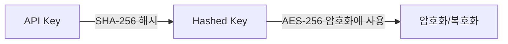

## 암호화 옵션
<CardGroup cols={2}>
  <Card title="쿼리 스트링 암호화" icon="square-1">
    쿼리 스트링 암호화
  </Card>
  <Card title="안전한 데이터 전송 옵션" icon="square-2">
    안전한 데이터 전송 옵션
  </Card>
  <Card title="암/복호화 방식" icon="square-3">
      암/복호화 방식 
  </Card>
</CardGroup>

## 1. 쿼리 스트링 암호화

URL의 쿼리 스트링으로 전송되는 민감한 데이터를 AES-256 방식으로 암호화합니다.

<Steps>
  <Step title="암호화할 데이터를 JSON 형식으로 준비">
    <CodeGroup>
    ```javascript data.json
    {
        "email": "email@email.com",
        "userid": "userid",
        "cf1": "value 1",
        "cf2": "value 2",
        "cf3": "value 3",
        "blacklistCountries": false,
        "approvePeriod": false,
        "rejectPeriod": false,
        "ageLimit": false,
        "rejectDuplicateUser": true,
        "token": "token_id",
        "allowedCountries": "USA, KOR"
    }
    ```
    </CodeGroup>
  </Step>
  <Step title="제공된 API 키로 AES-256 암호화 수행">
    
    <Note>AES-256 암호화 수행 전에 쿼리 스트링 암호화 및 복호화 단계를 확인해주세요.</Note>
  </Step>
  <Step title="암호화된 데이터를 URL의 encrypted 쿼리 파라미터에 추가">
      <CodeGroup>
      ```text exmaple.txt
      https://form.argosidentity.com/?pid={project_Id}&encrypted={encrypted_json_text}
      ```
      </CodeGroup>
  </Step>
</Steps>

<Warning> 주의: pid, lang 쿼리 스트링 및 ‘추가 프로세스 (Injection)’ 페이지에서 사용하는 sid, action 쿼리 스트링은 암호화를 지원하지 않습니다. </Warning>

## 2. 쿼리 스트링 암호화 및 복호화 방법

### 2-1. 키 생성 프로세스


<Steps>
  <Step title="Hashed Key 생성">
    <CodeGroup>
    ```javascript Node.js(crpyto module)
    var crypto = require('crypto');
    var hashedKey = crypto.createHash('sha256').update(APIKEY).digest();

    ```
    ```javascript Node.js(crypto-js library)
    import CryptoJS from 'crypto-js';
    const hashedKey = CryptoJS.SHA256(APIKEY);

    ```
    </CodeGroup>
  </Step>
  <Step title="암호화 예시">
  아래 예시는 데이터를 AES-256 방식으로 암호화하는 방법을 보여줍니다.
      <CodeGroup>
    ```javascript Node.js(crpyto module)
      var crypto = require('crypto');

      /**
      * @param {string} data - Stringified JSON data
      * @param {string} apiKey - Project API key
      * @returns {string} Encrypted data
      */
      function encrypt(data, apiKey) {
        var hashedKey = crypto.createHash('sha256').update(apiKey).digest();
        var cipher = crypto.createCipheriv('aes-256-ecb', hashedKey, null);
        return cipher.update(data, 'utf8', 'base64') + cipher.final('base64');
      }
    ```
    ```javascript Node.js(crypto-js library)
   import CryptoJS from 'crypto-js';

    const encrypt = (data, apiKey) => {
      const hashedKey = CryptoJS.SHA256(apiKey);
      const encrypted = CryptoJS.AES.encrypt(data, hashedKey, {
        mode: CryptoJS.mode.ECB,
      });
      return encrypted.ciphertext.toString(CryptoJS.enc.Base64);
    };

    ```
    ```java java(crypto-js library)
    import javax.crypto.Cipher;
    import javax.crypto.spec.SecretKeySpec;
    import java.nio.charset.StandardCharsets;
    import java.security.MessageDigest;
    import java.util.Base64;

    public class Encryption {
        public static String encrypt(String data, String apiKey) throws Exception {
            // API 키를 SHA-256으로 해시
            MessageDigest digest = MessageDigest.getInstance("SHA-256");
            byte[] hashedKey = digest.digest(apiKey.getBytes(StandardCharsets.UTF_8));
            
            // AES-256 호환을 위한 32바이트 길이 보장
            byte[] aesCompatibleKey = new byte[32];
            System.arraycopy(hashedKey, 0, aesCompatibleKey, 0, 32);
            
            // AES 암호화를 위한 키 생성
            SecretKeySpec secretKey = new SecretKeySpec(hashedKey, "AES");
            
            // AES/ECB/PKCS5Padding 모드로 Cipher 초기화
            Cipher cipher = Cipher.getInstance("AES/ECB/PKCS5Padding");
            cipher.init(Cipher.ENCRYPT_MODE, secretKey);
            
            // 데이터 암호화
            byte[] encryptedBytes = cipher.doFinal(data.getBytes(StandardCharsets.UTF_8));
            
            // Base64 인코딩하여 결과 반환
            return Base64.getEncoder().encodeToString(encryptedBytes);
        }
    }
    ```
    </CodeGroup>
  </Step>
  <Step title="복호화 예시">
  아래 예시는 AES-256 방식으로 암호화된 데이터를 복호화하는 방법을 보여줍니다.
    <CodeGroup>
    ```javascript Node.js(crpyto module)
        var crypto = require('crypto');

      /**
      * @param {string} encryptedData
      * @param {string} apiKey
      * @returns {string} Decrypted data
      */
      function decrypt(encryptedData, apiKey) {
        var hashedKey = crypto.createHash('sha256').update(apiKey).digest();
        var decipher = crypto.createDecipheriv('aes-256-ecb', hashedKey, null);
        return decipher.update(encryptedData, 'base64', 'utf8') + decipher.final('utf8');
      }

    ```
    ```javascript Node.js(crypto-js library)
   import CryptoJS from 'crypto-js';

    const decrypt = (encryptedData, apiKey) => {
      const hashedKey = CryptoJS.SHA256(apiKey);
      const decrypted = CryptoJS.AES.decrypt(encryptedData, hashedKey, {
        mode: CryptoJS.mode.ECB
      });
      return decrypted.toString(CryptoJS.enc.Utf8);
    };
    ```
    </CodeGroup>
  </Step>
</Steps>

## 3. 안전한 데이터 전송 옵션

API 메서드(POST/SUBMISSION, GET/SUBMISSION, PUT/SUBMISSION, WEBHOOK)에서 데이터를 <Tooltip tip="AES-256-CBC는 256비트 키를 사용하는 대칭키 블록 암호화 알고리즘으로, 데이터를 128비트 블록 단위로 암호화합니다. CBC(암호 블록 연결) 모드는 각 블록이 이전 블록의 암호문과 XOR 연산된 후 암호화되어 보안성을 높입니다. 금융 및 정부 기관에서도 널리 사용되는 안전한 암호화 방식입니다."> AES-256-CBC</Tooltip>
 및 <Tooltip tip="디지털 인증서를 생성, 관리, 배포하여 안전한 통신을 가능하게 하는 시스템입니다. 공개키 암호화를 사용하여 인터넷 상의 신원 확인과 데이터 보안을 제공합니다.">PKI</Tooltip> 방식으로 암호화하여 전송합니다.

### 3-1. 주요 특징
- AES-256-CBC 알고리즘을 사용하여 데이터 암호화
- PKI를 통한 데이터 무결성 및 인증 보장
- 전송 중 데이터 보호 강화


### 3-2. 데이터 암호화 및 복호화 프로세스
API 에서 송수신되는 데이터는 AES-256-CBC 방식으로 암호화되며, 키 관리는 SHA-256 해시 기반으로 수행됩니다.

1. 암호화 알고리즘 상세
- 암호화 방식 : AES-256-CBC
- 키 생성 : SHA-256 해시 기반
- 출력 인코딩 : Base64

2. 암호화 파라미터
- Key Size : 32 bytes (256 bits)
- IV Size : 16 bytes (128 bits)
- 문자 인코딩 : UTF-8

### 3-3 . Payload 암호화 과정
클라이언트에서 데이터를 암호화하는 과정은 아래 JavaScript 예제와 같습니다.
    <CodeGroup>
    ```javascript Node.js(crypto-js library)
    var crypto = require('crypto');import CryptoJS from 'crypto-js';

    function generateKeyAndIV(apiKey) {
        const hashedKey = CryptoJS.SHA256(apiKey);
        const key = CryptoJS.lib.WordArray.create(hashedKey.words.slice(0, 8), 32);
        const iv = CryptoJS.lib.WordArray.create(hashedKey.words.slice(8, 12), 16);
        return { key, iv };
    }

    function encrypt(data, apiKey) {
        const { key, iv } = generateKeyAndIV(apiKey);
        const encrypted = CryptoJS.AES.encrypt(JSON.stringify(data), key, { iv: iv, mode: CryptoJS.mode.CBC });
        return encrypted.ciphertext.toString(CryptoJS.enc.Base64);
    }

    ```
    </CodeGroup>

### 3-4. Payload 복호화 과정
수신된 암호화된 데이터를 복호화하는 방법을 설명합니다.
    <CodeGroup>
    ```kotlin Decrpyt Module
  import javax.crypto.Cipher
  import javax.crypto.spec.IvParameterSpec
  import javax.crypto.spec.SecretKeySpec
  import java.security.MessageDigest
  import java.util.Base64
  import java.nio.charset.StandardCharsets

  class DecryptionException(message: String, cause: Throwable? = null) : Exception(message, cause)

  class Decryptor {
      companion object {
          private const val ALGORITHM = "AES/CBC/PKCS5Padding"
          private const val KEY_ALGORITHM = "AES"
          private const val HASH_ALGORITHM = "SHA-256"
      }

      fun decrypt(encryptedData: String, apiKey: String): String {
          try {
              val digest = MessageDigest.getInstance(HASH_ALGORITHM)
              val hashedBytes = digest.digest(apiKey.toByteArray(StandardCharsets.UTF_8))
              
              val cipherBytes = Base64.getDecoder().decode(encryptedData.trim())

              val key = SecretKeySpec(hashedBytes.copyOf(32), KEY_ALGORITHM)
              val iv = IvParameterSpec(hashedBytes.copyOfRange(16, 32)) // IV를 해시에서 추출

              val cipher = Cipher.getInstance(ALGORITHM)
              cipher.init(Cipher.DECRYPT_MODE, key, iv)

              val decryptedBytes = cipher.doFinal(cipherBytes)
              return String(decryptedBytes, StandardCharsets.UTF_8)

          } catch (e: Exception) {
              throw DecryptionException("복호화 실패: ${e.message}", e)
          }
      }
  }
  ```
  ```javascript Node.js(crpyto module)
    import CryptoJS from 'crypto-js';

    function generateKeyAndIV(apiKey) {
        const hashedKey = CryptoJS.SHA256(apiKey); 
        const key = CryptoJS.lib.WordArray.create(hashedKey.words.slice(0, 8), 32); 
        const iv = CryptoJS.lib.WordArray.create(hashedKey.words.slice(8, 12), 16);
        return { key, iv };
    }

    function decrypt(encryptedData, apiKey) {
        const { key, iv } = generateKeyAndIV(apiKey);
        const decrypted = CryptoJS.AES.decrypt(
            CryptoJS.lib.CipherParams.create({ ciphertext: CryptoJS.enc.Base64.parse(encryptedData) }), key, { iv: iv, mode: CryptoJS.mode.CBC });
        return JSON.parse(decrypted.toString(CryptoJS.enc.Utf8));
    }
    ```
  </CodeGroup>

### 3-5. 사용 예시
  <CodeGroup>
    ```kotlin Decrpyt Module
    fun main() {
    val apiKey = "your-api-key"
    val encryptedPayload = "encrypted-payload"

    val decryptor = WebhookDecryptor()
    try {
        val decryptedJson = decryptor.decrypt(encryptedPayload, apiKey)
        println("$decryptedJson")
    } catch (e: DecryptionException) {
        println("${e.message}")
        e.printStackTrace()
    }
  }
    ```
    ```javascript Node.js(crpyto module)
    import CryptoJS from 'crypto-js';

    function main() {
        const apiKey = "your-api-key"
        const encryptedPayload = "encrypted-base64-string"
        const decryptedJson = decrypt(encryptedPayload, apiKey);
        console.log("Decrypted webhook payload: ", decryptedJson)
    }
    ```
  </CodeGroup>

