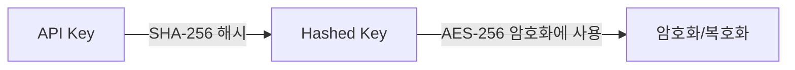

고객 데이터를 안전하게 보호하고 무단 접근과 데이터 유출 위험을 최소화하기 위한 강력한 암호화 솔루션을 제공합니다. 최신 보안 표준을 준수하며, 다양한 환경에서 쉽게 구현할 수 있는 방법을 상세히 설명합니다.

## 암호화 옵션
<CardGroup cols={2}>
  <Card title="쿼리 스트링 암호화" icon="square-1">
    쿼리 스트링 암호화
  </Card>
  <Card title="안전한 데이터 전송 옵션" icon="square-2">
    안전한 데이터 전송 옵션
  </Card>
  <Card title="암/복호화 방식" icon="square-3">
      암/복호화 방식 
  </Card>
</CardGroup>

## 1. 쿼리 스트링 암호화

URL의 쿼리 스트링으로 전송되는 민감한 데이터를 AES-256 방식으로 암호화합니다.

<Steps>
  <Step title="암호화할 데이터를 JSON 형식으로 준비">
    <CodeGroup>
    ```javascript data.json
    {
        "email": "email@email.com",
        "userid": "userid",
        "cf1": "value 1",
        "cf2": "value 2",
        "cf3": "value 3",
        "blacklistCountries": false,
        "approvePeriod": false,
        "rejectPeriod": false,
        "ageLimit": false,
        "rejectDuplicateUser": true,
        "token": "token_id",
        "allowedCountries": "USA, KOR"
    }
    ```
    </CodeGroup>
  </Step>
  <Step title="제공된 API 키로 AES-256 암호화 수행">
    

  </Step>
  <Step title="암호화된 데이터를 URL의 encrypted 쿼리 파라미터에 추가">
      <CodeGroup>
      ```text exmaple.txt
      https://form.argosidentity.com/?pid={project_Id}&encrypted={encrypted_json_text}
      ```

      </CodeGroup>
  </Step>
</Steps>

<Warning> 주의: pid, lang, sid, action 쿼리 파라미터는 암호화하지 않습니다</Warning>
 pid, lang 쿼리 스트링 및 ‘추가 프로세스 (Injection)’ 페이지에서 사용하는 sid, action 쿼리 스트링은 암호화를 지원하지 않습니다. 

## 2. 안전한 데이터 전송 옵션

API 메서드(POST/SUBMISSION, GET/SUBMISSION, PUT/SUBMISSION, WEBHOOK)에서 데이터를 <Tooltip tip="256비트 키를 사용하는 대칭키 암호화 알고리즘으로, 데이터를 128비트 블록 단위로 암호화합니다. 매우 안전하여 정부 기관과 금융 기관에서 널리 사용되는 암호화 표준입니다."> AES-256</Tooltip>
 및 <Tooltip tip="디지털 인증서를 생성, 관리, 배포하여 안전한 통신을 가능하게 하는 시스템입니다. 공개키 암호화를 사용하여 인터넷 상의 신원 확인과 데이터 보안을 제공합니다.">PKI</Tooltip> 방식으로 암호화하여 전송합니다.

### 2-1. 주요 특징
- AES-256을 사용한 데이터 암호화
- PKI를 통한 데이터 무결성 및 인증 보장
- 전송 중 데이터 보호 강화

 


## 3. 암호화 및 복호화 방식

### 3-1. 키 생성 프로세스


<Steps>
  <Step title="Hashed Key 생성">
    <CodeGroup>
    ```javascript Node.js(crpyto module)
    var crypto = require('crypto');
    var hashedKey = crypto.createHash('sha256').update(APIKEY).digest();

    ```
    ```javascript Node.js(crypto-js library)
    import CryptoJS from 'crypto-js';
    const hashedKey = CryptoJS.SHA256(APIKEY);

    ```
    </CodeGroup>
  </Step>
  <Step title="암호화 예시">
  아래 예시는 데이터를 AES-256 방식으로 암호화하는 방법을 보여줍니다.
      <CodeGroup>
    ```javascript Node.js(crpyto module)
      var crypto = require('crypto');

      /**
      * @param {string} data - Stringified JSON data
      * @param {string} apiKey - Project API key
      * @returns {string} Encrypted data
      */
      function encrypt(data, apiKey) {
        var hashedKey = crypto.createHash('sha256').update(apiKey).digest();
        var cipher = crypto.createCipheriv('aes-256-ecb', hashedKey, null);
        return cipher.update(data, 'utf8', 'base64') + cipher.final('base64');
      }
    ```
    ```javascript Node.js(crypto-js library)
   import CryptoJS from 'crypto-js';

    const encrypt = (data, apiKey) => {
      const hashedKey = CryptoJS.SHA256(apiKey);
      const encrypted = CryptoJS.AES.encrypt(data, hashedKey, {
        mode: CryptoJS.mode.ECB,
      });
      return encrypted.ciphertext.toString(CryptoJS.enc.Base64);
    };

    ```
    ```java java(crypto-js library)
      import javax.crypto.Cipher;
      import javax.crypto.spec.SecretKeySpec;
      import java.nio.charset.StandardCharsets;
      import java.security.MessageDigest;
      import java.util.Base64;

      public class Encryption {
          public static String encrypt(String data, String apiKey) throws Exception {
              // API 키를 SHA-256으로 해시
              MessageDigest digest = MessageDigest.getInstance("SHA-256");
              byte[] hashedKey = digest.digest(apiKey.getBytes(StandardCharsets.UTF_8));

              // AES 암호화를 위한 키 생성
              SecretKeySpec secretKey = new SecretKeySpec(hashedKey, "AES");

              // AES/ECB/PKCS5Padding 모드로 Cipher 초기화
              Cipher cipher = Cipher.getInstance("AES/ECB/PKCS5Padding");
              cipher.init(Cipher.ENCRYPT_MODE, secretKey);

              // 데이터 암호화
              byte[] encryptedBytes = cipher.doFinal(data.getBytes(StandardCharsets.UTF_8));

              // Base64 인코딩하여 결과 반환
              return Base64.getEncoder().encodeToString(encryptedBytes);
          }
      }
    ```
    </CodeGroup>
  </Step>
  <Step title="복호화 예시">
  아래 예시는 AES-256 방식으로 암호화된 데이터를 복호화하는 방법을 보여줍니다.
    <CodeGroup>
    ```javascript Node.js(crpyto module)
        var crypto = require('crypto');

      /**
      * @param {string} encryptedData
      * @param {string} apiKey
      * @returns {string} Decrypted data
      */
      function decrypt(encryptedData, apiKey) {
        var hashedKey = crypto.createHash('sha256').update(apiKey).digest();
        var decipher = crypto.createDecipheriv('aes-256-ecb', hashedKey, null);
        return decipher.update(encryptedData, 'base64', 'utf8') + decipher.final('utf8');
      }

    ```
    ```javascript Node.js(crypto-js library)
   import CryptoJS from 'crypto-js';

    const decrypt = (encryptedData, apiKey) => {
      const hashedKey = CryptoJS.SHA256(apiKey);
      const decrypted = CryptoJS.AES.decrypt(encryptedData, hashedKey, {
        mode: CryptoJS.mode.ECB
      });
      return decrypted.toString(CryptoJS.enc.Utf8);
    };
    ```
    </CodeGroup>
  </Step>
</Steps>

