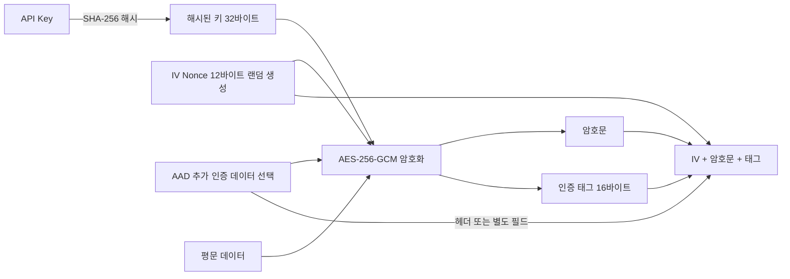

## 암복호화 도구

<Tip>
  개발 목적을 위해 암복호화 도구를 제공합니다.\
  필요시 [링크](https://argos-logo.s3.ap-northeast-2.amazonaws.com/developer_guide/EncryptionTool_0616.zip)에서 다운로드 하셔서 사용하시기 바랍니다.

  맥OS에서 사용시, 첫 실행때 "개인정보 보호 및 보안" 설정에서 허용을 해주셔야 사용이 가능합니다.
</Tip>


## 암호화 옵션

<CardGroup cols="2">
  <Card title="쿼리 스트링 암호화 모듈의 종류" icon="square-1">
    암호화 모듈의 종류
  </Card>
  <Card title="쿼리 스트링 암호화" icon="square-2">
    쿼리 스트링 암호화
  </Card>
  <Card title="안전한 데이터 전송 옵션" icon="square-3">
    안전한 데이터 전송 옵션
  </Card>
  <Card title="암/복호화 방식" icon="square-4">
    암/복호화 방식
  </Card>
</CardGroup>

## 1. 암호화 모듈의 종류
적용 가능한 암호화 모듈의 종류는 다음 두가지 입니다.
- AES-256: 빠르고 간단한 블록 암호화 방식
- GCM-256: 인증 및 무결성 기능을 포함한 강화된 암호화 방식

### 암호화 키 종류
- API 키: Project에 부여된 API 키
- Custom API 키: 라이브폼에서 신규로 발급받아 사용하는 secretKey


## 2. 쿼리 스트링 암호화

URL의 쿼리 스트링으로 전송되는 민감한 데이터를 AES-256 방식이나 GCM-256 방식으로 암호화합니다.

<Steps>
  <Step title="암호화할 데이터를 JSON 형식으로 준비">
    <Info>
      각 Query String 키에 대한 설명은 다음 링크를 참조하세요.

      [주요 QueryString 파라미터](https://developers.argosidentity.com/getting-started/ko/liveform-url/querystring-and-token-guide#2-1-%EC%A3%BC%EC%9A%94-querystring-%ED%8C%8C%EB%9D%BC%EB%AF%B8%ED%84%B0)
    </Info>
    <CodeGroup>

    ```json id_document.json
    {
        "email": "email@email.com",
        "userid": "userid",
        "cf1": "value 1",
        "cf2": "value 2",
        "cf3": "value 3",
        "blacklistCountries": false,
        "approvePeriod": false,
        "rejectPeriod": false,
        "ageLimit": false,
        "rejectDuplicateUser": true,
        "token": "token_id",
        "allowedCountries": "USA,KOR"
    }
    ```

    
    ```json knowledge_based.json
    {
        "email": "email@email.com",
        "userid": "userid",
        "cf1": "value 1",
        "cf2": "value 2",
        "cf3": "value 3",
        "knowledgeField": "birthDate,gender,nationality,name,SSN,name,address,phoneNumber",
        "knowledgePrefill" : "gender=male,nationality=USA,SSN=123-34-0001,address=Washington D.C.,name=Brown James,birthDate=1980-01-01,phoneNumber=+15555551234",
        "blacklistCountries": false,
        "ageLimit": false,
        "rejectDuplicateUser": true,
        "allowedCountries": "USA"
    }
    ```

    </CodeGroup>
  </Step>
  <Step title="암호화 모듈 AES-256/GCM-256 및 API 키 및 secretKey 중 하나를 선택">
    
    <Note>
      secretKey의 경우 한번 발급 이후 표시되지 않습니다. 분실 시, 재발급해서 사용해주세요.
    </Note>
  </Step>
  <Step title="제공된 API 키로 AES-256/GCM-256 암호화 수행">
    

    <Note>
      AES-256 암호화 수행 전에 쿼리 스트링 암호화 및 복호화 단계를 확인해주세요. <br />
      secretKey를 발급받은 경우, secretKey를 활용해주세요.
    </Note>
  </Step>
  <Step title="암호화된 데이터를 URL의 encrypted 쿼리 파라미터에 추가">
    <CodeGroup>

    ```text example.url
    https://form.argosidentity.com/?pid={project_Id}&encrypted={encrypted_json_text}
    ```

    </CodeGroup>
  </Step>
</Steps>

<Warning>
  주의: pid, lang 쿼리 스트링 및 ‘추가 프로세스 (Injection)’ 페이지에서 사용하는 sid, action 쿼리 스트링은 암호화를 지원하지 않습니다.
</Warning>

## 3. 쿼리 스트링 암호화 및 복호화 방법

### 3-1. 키 생성 프로세스
AES-256

GCM-256


<Steps>
  <Step title="Hashed Key 생성">
    <CodeGroup>

    ```javascript Node.js(crypto module)
    var crypto = require('crypto');
    var hashedKey = crypto.createHash('sha256').update(APIKEY).digest();
    
    ```

    
    ```javascript Node.js(crypto-js library)
    const CryptoJS = require('crypto-js');
    const hashedKey = CryptoJS.SHA256(APIKEY);
    
    ```

    </CodeGroup>
  </Step>
  <Step title="암호화 예시">
    아래 예시는 데이터를 AES-256 방식으로 암호화하는 방법을 보여줍니다.

    <CodeGroup>

    ```javascript Node.js(crypto module)
      var crypto = require('crypto');
    
      /**
      * @param {string} data - Stringified JSON data
      * @param {string} apiKey - Project API key
      * @returns {string} Encrypted data
      *
      * 정확한 암호화를 위해선 formatJSON 으로 사용해주세요. 예시는 다음과 같습니다.
      * const data = {
          userid: "10912301",
          email: "email@email.com"
      * };
      *
      * 다음과 같이 직접 string 으로 입력을 피해주세요.
      * 기대한 암호화 결과가 달라질 수 있습니다.
      * `{"userid":"10912301","email":"email@email.com"}`
      */
    
      function encrypt(data, apiKey) {
        var hashedKey = crypto.createHash('sha256').update(apiKey).digest();
        var cipher = crypto.createCipheriv('aes-256-ecb', hashedKey, null);
        return cipher.update(data, 'utf8', 'base64') + cipher.final('base64');
      }
    ```

    
    ```javascript Node.js(crypto-js library)
    const CryptoJS = require('crypto-js');
    
    const encrypt = (data, apiKey) => {
      const hashedKey = CryptoJS.SHA256(apiKey);
      const encrypted = CryptoJS.AES.encrypt(data, hashedKey, {
        mode: CryptoJS.mode.ECB,
      });
      return encrypted.ciphertext.toString(CryptoJS.enc.Base64);
    };
    
    ```

    
    ```java java(crypto-js library)
    import javax.crypto.Cipher;
    import javax.crypto.spec.SecretKeySpec;
    import java.nio.charset.StandardCharsets;
    import java.security.MessageDigest;
    import java.util.Base64;
    
    public class Encryption {
        public static String encrypt(String data, String apiKey) throws Exception {
            // API 키를 SHA-256으로 해시
            MessageDigest digest = MessageDigest.getInstance("SHA-256");
            byte[] hashedKey = digest.digest(apiKey.getBytes(StandardCharsets.UTF_8));
            
            // AES-256 호환을 위한 32바이트 길이 보장
            byte[] aesCompatibleKey = new byte[32];
            System.arraycopy(hashedKey, 0, aesCompatibleKey, 0, 32);
            
            // AES 암호화를 위한 키 생성
            SecretKeySpec secretKey = new SecretKeySpec(hashedKey, "AES");
            
            // AES/ECB/PKCS5Padding 모드로 Cipher 초기화
            Cipher cipher = Cipher.getInstance("AES/ECB/PKCS5Padding");
            cipher.init(Cipher.ENCRYPT_MODE, secretKey);
            
            // 데이터 암호화
            byte[] encryptedBytes = cipher.doFinal(data.getBytes(StandardCharsets.UTF_8));
            
            // Base64 인코딩하여 결과 반환
            return Base64.getEncoder().encodeToString(encryptedBytes);
        }
    }
    ```

    </CodeGroup>
  </Step>
  <Step title="GCM 암호화 예시">
    아래 예시는 데이터를 AES-256-GCM 방식으로 암호화하는 방법을 보여줍니다.

    <CodeGroup>

    ```javascript Node.js(crypto module)
    var crypto = require('crypto');

    /**
     * @param {string} data - Stringified JSON data
     * @param {string} apiKey - Project API key
     * @returns {string} Encrypted data in hex format (IV + ciphertext + tag)
     *
     * GCM 모드는 인증된 암호화를 제공하며, IV와 인증 태그가 포함됩니다.
     * 반환값은 12바이트 IV + 암호문 + 16바이트 인증 태그를 hex 문자열로 인코딩한 형태입니다.
     */
    function encryptGCM(data, apiKey) {
        var hashedKey = crypto.createHash('sha256').update(apiKey).digest();
        var iv = crypto.randomBytes(12);
        var cipher = crypto.createCipheriv('aes-256-gcm', hashedKey, iv);
        
        var encrypted = cipher.update(data, 'utf8');
        encrypted = Buffer.concat([encrypted, cipher.final()]);
        
        var tag = cipher.getAuthTag();
        var result = Buffer.concat([iv, encrypted, tag]);
        
        return result.toString('hex');
    }

    /**
     * @param {string} encryptedHex - Hex encoded encrypted data
     * @param {string} apiKey - Project API key
     * @returns {string} Decrypted data
     */
    function decryptGCM(encryptedHex, apiKey) {
        var hashedKey = crypto.createHash('sha256').update(apiKey).digest();
        var encryptedBuffer = Buffer.from(encryptedHex, 'hex');
        
        var iv = encryptedBuffer.slice(0, 12);
        var tag = encryptedBuffer.slice(-16);
        var encrypted = encryptedBuffer.slice(12, -16);
        
        var decipher = crypto.createDecipheriv('aes-256-gcm', hashedKey, iv);
        decipher.setAuthTag(tag);
        
        var decrypted = decipher.update(encrypted);
        decrypted = Buffer.concat([decrypted, decipher.final()]);
        
        return decrypted.toString('utf8');
    }
    ```

    ```javascript Node.js(crypto-js library)
    const CryptoJS = require('crypto-js');

    /**
     * @param {string} data - Stringified JSON data
     * @param {string} apiKey - Project API key
     * @returns {string} Encrypted data in hex format
     */
    const encryptGCM = (data, apiKey) => {
        const hashedKey = CryptoJS.SHA256(apiKey);
        const iv = CryptoJS.lib.WordArray.random(12);
        
        // GCM 모드는 crypto-js에서 직접 지원하지 않으므로 
        // Node.js crypto 모듈을 사용하는 것을 권장합니다.
        // 아래는 개념적인 예시입니다.
        
        // 실제 구현시에는 Node.js crypto 모듈 사용을 권장
        throw new Error('GCM 모드는 crypto-js에서 지원하지 않습니다. Node.js crypto 모듈을 사용하세요.');
    };

    /**
     * @param {string} encryptedHex - Hex encoded encrypted data
     * @param {string} apiKey - Project API key
     * @returns {string} Decrypted data
     */
    const decryptGCM = (encryptedHex, apiKey) => {
        // crypto-js는 GCM을 지원하지 않으므로 Node.js crypto 모듈 사용 권장
        throw new Error('GCM 모드는 crypto-js에서 지원하지 않습니다. Node.js crypto 모듈을 사용하세요.');
    };
    ```

    ```java Java
    import javax.crypto.Cipher;
    import javax.crypto.spec.GCMParameterSpec;
    import javax.crypto.spec.SecretKeySpec;
    import java.nio.charset.StandardCharsets;
    import java.security.MessageDigest;
    import java.security.SecureRandom;
    import java.util.Base64;
    import java.util.HexFormat;

    public class GCMEncryption {
        private static final int GCM_IV_LENGTH = 12;
        private static final int GCM_TAG_LENGTH = 16;

        /**
         * @param data - Stringified JSON data
         * @param apiKey - Project API key
         * @return Encrypted data in hex format (IV + ciphertext + tag)
         */
        public static String encryptGCM(String data, String apiKey) throws Exception {
            // API 키를 SHA-256으로 해시
            MessageDigest digest = MessageDigest.getInstance("SHA-256");
            byte[] hashedKey = digest.digest(apiKey.getBytes(StandardCharsets.UTF_8));
            
            // AES 암호화를 위한 키 생성
            SecretKeySpec secretKey = new SecretKeySpec(hashedKey, "AES");
            
            // GCM 모드로 Cipher 초기화
            Cipher cipher = Cipher.getInstance("AES/GCM/NoPadding");
            
            // 12바이트 IV 생성
            byte[] iv = new byte[GCM_IV_LENGTH];
            SecureRandom random = new SecureRandom();
            random.nextBytes(iv);
            
            // GCM 파라미터 설정 (태그 길이 128비트)
            GCMParameterSpec gcmSpec = new GCMParameterSpec(GCM_TAG_LENGTH * 8, iv);
            cipher.init(Cipher.ENCRYPT_MODE, secretKey, gcmSpec);
            
            // 데이터 암호화
            byte[] encryptedBytes = cipher.doFinal(data.getBytes(StandardCharsets.UTF_8));
            
            // IV + 암호문 + 태그를 결합하여 hex로 인코딩
            byte[] result = new byte[iv.length + encryptedBytes.length];
            System.arraycopy(iv, 0, result, 0, iv.length);
            System.arraycopy(encryptedBytes, 0, result, iv.length, encryptedBytes.length);
            
            return HexFormat.of().formatHex(result);
        }

        /**
         * @param encryptedHex - Hex encoded encrypted data
         * @param apiKey - Project API key
         * @return Decrypted data
         */
        public static String decryptGCM(String encryptedHex, String apiKey) throws Exception {
            // API 키를 SHA-256으로 해시
            MessageDigest digest = MessageDigest.getInstance("SHA-256");
            byte[] hashedKey = digest.digest(apiKey.getBytes(StandardCharsets.UTF_8));
            
            // AES 복호화를 위한 키 생성
            SecretKeySpec secretKey = new SecretKeySpec(hashedKey, "AES");
            
            // hex 문자열을 바이트 배열로 변환
            byte[] encryptedData = HexFormat.of().parseHex(encryptedHex);
            
            // IV와 암호문 분리
            byte[] iv = new byte[GCM_IV_LENGTH];
            byte[] ciphertext = new byte[encryptedData.length - GCM_IV_LENGTH];
            System.arraycopy(encryptedData, 0, iv, 0, GCM_IV_LENGTH);
            System.arraycopy(encryptedData, GCM_IV_LENGTH, ciphertext, 0, ciphertext.length);
            
            // GCM 모드로 Cipher 초기화
            Cipher cipher = Cipher.getInstance("AES/GCM/NoPadding");
            GCMParameterSpec gcmSpec = new GCMParameterSpec(GCM_TAG_LENGTH * 8, iv);
            cipher.init(Cipher.DECRYPT_MODE, secretKey, gcmSpec);
            
            // 데이터 복호화
            byte[] decryptedBytes = cipher.doFinal(ciphertext);
            return new String(decryptedBytes, StandardCharsets.UTF_8);
        }
    }
    ```

    ```python Python
    import os
    import base64
    from cryptography.hazmat.primitives import hashes
    from cryptography.hazmat.primitives.ciphers.aead import AESGCM

    def hashed_key(api_key: str) -> bytes:
        """API 키를 SHA-256으로 해시하여 32바이트 키 생성"""
        digest = hashes.Hash(hashes.SHA256())
        digest.update(api_key.encode("utf-8"))
        return digest.finalize()

    def encrypt_gcm(data: str, api_key: str) -> str:
        """
        AES-256-GCM 방식으로 데이터를 암호화합니다.
        
        Args:
            data: 암호화할 JSON 문자열
            api_key: 프로젝트 API 키
            
        Returns:
            hex 형식의 암호화된 데이터 (IV + ciphertext + tag)
        """
        key = hashed_key(api_key)
        iv = os.urandom(12)  # 12바이트 IV 생성
        aesgcm = AESGCM(key)
        
        # 데이터 암호화 (인증 태그 포함)
        ct_tag = aesgcm.encrypt(iv, data.encode("utf-8"), None)
        
        # IV + 암호문 + 태그를 결합하여 hex로 인코딩
        result = iv + ct_tag
        return result.hex()

    def decrypt_gcm(encrypted_hex: str, api_key: str) -> str:
        """
        AES-256-GCM 방식으로 암호화된 데이터를 복호화합니다.
        
        Args:
            encrypted_hex: hex 형식의 암호화된 데이터
            api_key: 프로젝트 API 키
            
        Returns:
            복호화된 데이터
        """
        key = hashed_key(api_key)
        encrypted_data = bytes.fromhex(encrypted_hex)
        
        # IV와 암호문+태그 분리
        iv = encrypted_data[:12]
        ct_tag = encrypted_data[12:]
        
        aesgcm = AESGCM(key)
        decrypted_data = aesgcm.decrypt(iv, ct_tag, None)
        return decrypted_data.decode("utf-8")
    ```

    </CodeGroup>
  </Step>
  <Step title="복호화 예시">
    아래 예시는 AES-256 방식으로 암호화된 데이터를 복호화하는 방법을 보여줍니다.

    <CodeGroup>

    ```javascript Node.js(crypto module)
        var crypto = require('crypto');
    
      /**
      * @param {string} encryptedData
      * @param {string} apiKey
      * @returns {string} Decrypted data
      */
      function decrypt(encryptedData, apiKey) {
        var hashedKey = crypto.createHash('sha256').update(apiKey).digest();
        var decipher = crypto.createDecipheriv('aes-256-ecb', hashedKey, null);
        return decipher.update(encryptedData, 'base64', 'utf8') + decipher.final('utf8');
      }
    
    ```

    
    ```javascript Node.js(crypto-js library)
    const CryptoJS = require('crypto-js');
    
    const decrypt = (encryptedData, apiKey) => {
      const hashedKey = CryptoJS.SHA256(apiKey);
      const decrypted = CryptoJS.AES.decrypt(encryptedData, hashedKey, {
        mode: CryptoJS.mode.ECB
      });
      return decrypted.toString(CryptoJS.enc.Utf8);
    };
    ```

    </CodeGroup>
  </Step>
  <Step title="GCM 복호화 예시">
    아래 예시는 AES-256-GCM 방식으로 암호화된 데이터를 복호화하는 방법을 보여줍니다.

    <CodeGroup>

    ```javascript Node.js(crypto module)
    var crypto = require('crypto');

    /**
     * @param {string} encryptedHex - Hex encoded encrypted data (IV + ciphertext + tag)
     * @param {string} apiKey - Project API key
     * @returns {string} Decrypted data
     */
    function decryptGCM(encryptedHex, apiKey) {
        var hashedKey = crypto.createHash('sha256').update(apiKey).digest();
        var encryptedBuffer = Buffer.from(encryptedHex, 'hex');
        
        // IV, 암호문, 태그 분리
        var iv = encryptedBuffer.slice(0, 12);
        var tag = encryptedBuffer.slice(-16);
        var encrypted = encryptedBuffer.slice(12, -16);
        
        var decipher = crypto.createDecipheriv('aes-256-gcm', hashedKey, iv);
        decipher.setAuthTag(tag);
        
        var decrypted = decipher.update(encrypted);
        decrypted = Buffer.concat([decrypted, decipher.final()]);
        
        return decrypted.toString('utf8');
    }
    ```

    ```javascript Node.js(crypto-js library)
    const CryptoJS = require('crypto-js');

    /**
     * @param {string} encryptedHex - Hex encoded encrypted data
     * @param {string} apiKey - Project API key
     * @returns {string} Decrypted data
     */
    const decryptGCM = (encryptedHex, apiKey) => {
        // crypto-js는 GCM을 지원하지 않으므로 Node.js crypto 모듈 사용 권장
        throw new Error('GCM 모드는 crypto-js에서 지원하지 않습니다. Node.js crypto 모듈을 사용하세요.');
    };
    ```

    ```java Java
    import javax.crypto.Cipher;
    import javax.crypto.spec.GCMParameterSpec;
    import javax.crypto.spec.SecretKeySpec;
    import java.nio.charset.StandardCharsets;
    import java.security.MessageDigest;
    import java.util.HexFormat;

    public class GCMDecryption {
        private static final int GCM_IV_LENGTH = 12;
        private static final int GCM_TAG_LENGTH = 16;

        /**
         * @param encryptedHex - Hex encoded encrypted data (IV + ciphertext + tag)
         * @param apiKey - Project API key
         * @return Decrypted data
         */
        public static String decryptGCM(String encryptedHex, String apiKey) throws Exception {
            // API 키를 SHA-256으로 해시
            MessageDigest digest = MessageDigest.getInstance("SHA-256");
            byte[] hashedKey = digest.digest(apiKey.getBytes(StandardCharsets.UTF_8));
            
            // AES 복호화를 위한 키 생성
            SecretKeySpec secretKey = new SecretKeySpec(hashedKey, "AES");
            
            // hex 문자열을 바이트 배열로 변환
            byte[] encryptedData = HexFormat.of().parseHex(encryptedHex);
            
            // IV와 암호문+태그 분리
            byte[] iv = new byte[GCM_IV_LENGTH];
            byte[] ciphertext = new byte[encryptedData.length - GCM_IV_LENGTH];
            System.arraycopy(encryptedData, 0, iv, 0, GCM_IV_LENGTH);
            System.arraycopy(encryptedData, GCM_IV_LENGTH, ciphertext, 0, ciphertext.length);
            
            // GCM 모드로 Cipher 초기화
            Cipher cipher = Cipher.getInstance("AES/GCM/NoPadding");
            GCMParameterSpec gcmSpec = new GCMParameterSpec(GCM_TAG_LENGTH * 8, iv);
            cipher.init(Cipher.DECRYPT_MODE, secretKey, gcmSpec);
            
            // 데이터 복호화
            byte[] decryptedBytes = cipher.doFinal(ciphertext);
            return new String(decryptedBytes, StandardCharsets.UTF_8);
        }
    }
    ```

    ```python Python
    import os
    from cryptography.hazmat.primitives import hashes
    from cryptography.hazmat.primitives.ciphers.aead import AESGCM

    def hashed_key(api_key: str) -> bytes:
        """API 키를 SHA-256으로 해시하여 32바이트 키 생성"""
        digest = hashes.Hash(hashes.SHA256())
        digest.update(api_key.encode("utf-8"))
        return digest.finalize()

    def decrypt_gcm(encrypted_hex: str, api_key: str) -> str:
        """
        AES-256-GCM 방식으로 암호화된 데이터를 복호화합니다.
        
        Args:
            encrypted_hex: hex 형식의 암호화된 데이터 (IV + ciphertext + tag)
            api_key: 프로젝트 API 키
            
        Returns:
            복호화된 데이터
        """
        key = hashed_key(api_key)
        encrypted_data = bytes.fromhex(encrypted_hex)
        
        # IV와 암호문+태그 분리
        iv = encrypted_data[:12]
        ct_tag = encrypted_data[12:]
        
        aesgcm = AESGCM(key)
        decrypted_data = aesgcm.decrypt(iv, ct_tag, None)
        return decrypted_data.decode("utf-8")
    ```

    </CodeGroup>
  </Step>
</Steps>

## 4. 안전한 데이터 전송 옵션

API 메서드(GET, POST, PATCH)와 WEBHOOK에서 데이터를 암호화하여 안전하게 전송합니다. API 메서드는 AES-256-ECB 방식을, WEBHOOK은 AES-256-CBC 방식을 사용하여 암호화합니다. 데이터를 안전하게 보호하기 위해 사용 전에 반드시 안전한 데이터 전송 기능이 활성화되어 있는지 확인하세요.

안전한 데이터 전송 기능이 활성화 되어 있을 경우, Request body 는 반드시 암호화하여 전송하여야 합니다. 암호화를 사용할 때: 전체 요청 본문 객체를 암호화합니다. 암호화된 문자열을 body 매개변수로 전송합니다. AES-256-ECB 형태로 암호화가 필요하며, 암호화 방법은 하기 주요 특징과 설명을 참조하세요.

<CodeGroup>

```json body
body : encrypt({
		email : 'string',
		fullName : 'string',
		issuingCountry : 'string',
		birthDate: 'string'
		...
	})
```

</CodeGroup>

응답에는 isEncrypted 플래그와 암호화된 데이터가 포함됩니다.

<CodeGroup>

```json response.json
body : {
    "data": "encrypted-string",
    "isEncrypted": true
}
```

</CodeGroup>

### 4-1. 주요 특징

- GET, POST, PATCH 요청은 `AES-256-ECB` 방식으로 암호화
- WEBHOOK 데이터는 `AES-256-CBC` 방식으로 암호화
- PKI를 통한 데이터 무결성 및 인증 보장
- 전송 중 데이터 보호 강화


### 4-2. API 요청 데이터 암호화 (AES-256-ECB)

<CodeGroup>

```javascript Node.js(crypto-js library)
const CryptoJS = require('crypto-js');

function encryptECB(data, apiKey) {
    const hashedKey = CryptoJS.SHA256(apiKey);
    const key = CryptoJS.lib.WordArray.create(hashedKey.words.slice(0, 8), 32);
    const encrypted = CryptoJS.AES.encrypt(JSON.stringify(data), key, {
        mode: CryptoJS.mode.ECB
    });
    return encrypted.ciphertext.toString(CryptoJS.enc.Base64);
}
```


```java AES-256-CBC.java
import javax.crypto.Cipher;
import javax.crypto.spec.SecretKeySpec;
import java.nio.charset.StandardCharsets;
import java.security.MessageDigest;
import java.util.Base64;
import com.google.gson.Gson;
import com.google.gson.JsonObject;

public class Encryptor {
    public static String encryptECB(JsonObject data, String apiKey) throws Exception {
        Gson gson = new Gson();
        String jsonData = gson.toJson(data);
        
        MessageDigest digest = MessageDigest.getInstance("SHA-256");
        byte[] rawKeyBytes = digest.digest(apiKey.getBytes(StandardCharsets.UTF_8));
        byte[] hashedKey = new byte[32];
        System.arraycopy(rawKeyBytes, 0, hashedKey, 0, 32);
        SecretKeySpec key = new SecretKeySpec(hashedKey, "AES");
        Cipher cipher = Cipher.getInstance("AES/ECB/PKCS5Padding");
        cipher.init(Cipher.ENCRYPT_MODE, key);
        
        byte[] encryptedBytes = cipher.doFinal(jsonData.getBytes(StandardCharsets.UTF_8));
        return Base64.getEncoder().encodeToString(encryptedBytes);
    }
}
```

</CodeGroup>

### 4-3.  API 데이터 복호화 (AES-256-ECB)

<CodeGroup>

```javascript Node.js(crypto-js library)
const CryptoJS = require('crypto-js');

function decryptECB(encryptedData, apiKey) {
    const hashedKey = CryptoJS.SHA256(apiKey);
    const key = CryptoJS.lib.WordArray.create(hashedKey.words.slice(0, 8), 32);
    const cipherParams = CryptoJS.lib.CipherParams.create({
        ciphertext: CryptoJS.enc.Base64.parse(encryptedData)
    });
    const decrypted = CryptoJS.AES.decrypt(cipherParams, key, {
        mode: CryptoJS.mode.ECB
    });
    return JSON.parse(decrypted.toString(CryptoJS.enc.Utf8));
}
```


```java AES-256-CBC.java
import javax.crypto.Cipher;
import javax.crypto.spec.SecretKeySpec;
import java.nio.charset.StandardCharsets;
import java.security.MessageDigest;
import java.util.Base64;
import com.google.gson.Gson;
import com.google.gson.JsonObject;

public class Encryptor {
    public static JsonObject decryptECB(String encryptedData, String apiKey) throws Exception {
        Gson gson = new Gson();
        MessageDigest digest = MessageDigest.getInstance("SHA-256");
        byte[] hashedKey = digest.digest(apiKey.getBytes(StandardCharsets.UTF_8));
        byte[] aesCompatibleKey = new byte[32];
        System.arraycopy(hashedKey, 0, aesCompatibleKey, 0, 32);
        SecretKeySpec key = new SecretKeySpec(aesCompatibleKey, "AES");
        Cipher cipher = Cipher.getInstance("AES/ECB/PKCS5Padding");
        cipher.init(Cipher.DECRYPT_MODE, key);
        
        byte[] decryptedBytes = cipher.doFinal(Base64.getDecoder().decode(encryptedData));
        String jsonData = new String(decryptedBytes, StandardCharsets.UTF_8);
        return gson.fromJson(jsonData, JsonObject.class);
    }
}
```

</CodeGroup>

### 4-4. WEBHOOK 데이터 암호화 (AES-256-CBC)

<CodeGroup>

```javascript Node.js(crypto-js library)
const CryptoJS = require('crypto-js');

function generateKeyAndIV(apiKey) {
    const hashedKey = CryptoJS.SHA256(apiKey);
    const key = CryptoJS.lib.WordArray.create(hashedKey.words.slice(0, 8), 32);
    const iv = CryptoJS.lib.WordArray.create(hashedKey.words.slice(8, 12), 16);
    return { key, iv };
}

function encryptCBC(data, apiKey) {
    const { key, iv } = generateKeyAndIV(apiKey);
    const encrypted = CryptoJS.AES.encrypt(JSON.stringify(data), key, { iv: iv, mode: CryptoJS.mode.CBC });
    return encrypted.ciphertext.toString(CryptoJS.enc.Base64);
}
```


```java AES-256-CBC.java
import javax.crypto.Cipher;
import javax.crypto.spec.SecretKeySpec;
import javax.crypto.spec.IvParameterSpec;
import java.nio.charset.StandardCharsets;
import java.security.MessageDigest;
import java.util.Base64;
import com.google.gson.Gson;
import com.google.gson.JsonObject;
import java.util.Arrays;

public class Encryptor {
    public static String encryptCBC(JsonObject data, String apiKey) throws Exception {
        String jsonData = new Gson().toJson(data);
        
        MessageDigest digest = MessageDigest.getInstance("SHA-256");
        byte[] hash = digest.digest(apiKey.getBytes(StandardCharsets.UTF_8));
        
        byte[] keyBytes = Arrays.copyOf(hash, 32);
        SecretKeySpec key = new SecretKeySpec(keyBytes, "AES");
        
        byte[] ivBytes = new byte[16];
        Arrays.fill(ivBytes, (byte) 0);
        IvParameterSpec iv = new IvParameterSpec(ivBytes);
        
        Cipher cipher = Cipher.getInstance("AES/CBC/PKCS5Padding");
        cipher.init(Cipher.ENCRYPT_MODE, key, iv);
        
        byte[] encryptedBytes = cipher.doFinal(jsonData.getBytes(StandardCharsets.UTF_8));
        return Base64.getEncoder().encodeToString(encryptedBytes);
    }
}
```

</CodeGroup>

### 4-5. WEBHOOK 데이터 복호화 (AES-256-CBC)

<CodeGroup>

```javascript Node.js(crypto-js library)
const CryptoJS = require('crypto-js');

function generateKeyAndIV(apiKey) {
    const hashedKey = CryptoJS.SHA256(apiKey);
    const key = CryptoJS.lib.WordArray.create(hashedKey.words.slice(0, 8), 32);
    const iv = CryptoJS.lib.WordArray.create(hashedKey.words.slice(8, 12), 16);
    return { key, iv };
}

function decryptCBC(encryptedData, apiKey) {
    const { key, iv } = generateKeyAndIV(apiKey);
    
    // Create cipher params for decryption
    const cipherParams = CryptoJS.lib.CipherParams.create({
        ciphertext: CryptoJS.enc.Base64.parse(encryptedData)
    });
    
    // Decrypt the data
    const decrypted = CryptoJS.AES.decrypt(cipherParams, key, {
        iv: iv,
        mode: CryptoJS.mode.CBC,
        padding: CryptoJS.pad.Pkcs7
    });
    
    return JSON.parse(decrypted.toString(CryptoJS.enc.Utf8));
}
```


```java AES-256-CBC.java
import javax.crypto.Cipher;
import javax.crypto.spec.SecretKeySpec;
import javax.crypto.spec.IvParameterSpec;
import java.nio.charset.StandardCharsets;
import java.security.MessageDigest;
import java.util.Base64;
import com.google.gson.Gson;
import com.google.gson.JsonObject;
import java.util.Arrays;

public class Encryptor {
    public static JsonObject decryptCBC(String encryptedData, String apiKey) throws Exception {
        MessageDigest digest = MessageDigest.getInstance("SHA-256");
        byte[] hash = digest.digest(apiKey.getBytes(StandardCharsets.UTF_8));
        
        byte[] keyBytes = Arrays.copyOf(hash, 32);
        SecretKeySpec key = new SecretKeySpec(keyBytes, "AES");
        
        byte[] ivBytes = new byte[16];
        Arrays.fill(ivBytes, (byte) 0);
        IvParameterSpec iv = new IvParameterSpec(ivBytes);
        
        Cipher cipher = Cipher.getInstance("AES/CBC/PKCS5Padding");
        cipher.init(Cipher.DECRYPT_MODE, key, iv);
        
        byte[] decryptedBytes = cipher.doFinal(Base64.getDecoder().decode(encryptedData));
        String jsonData = new String(decryptedBytes, StandardCharsets.UTF_8);
        
        return new Gson().fromJson(jsonData, JsonObject.class);
    }
}
```

</CodeGroup>